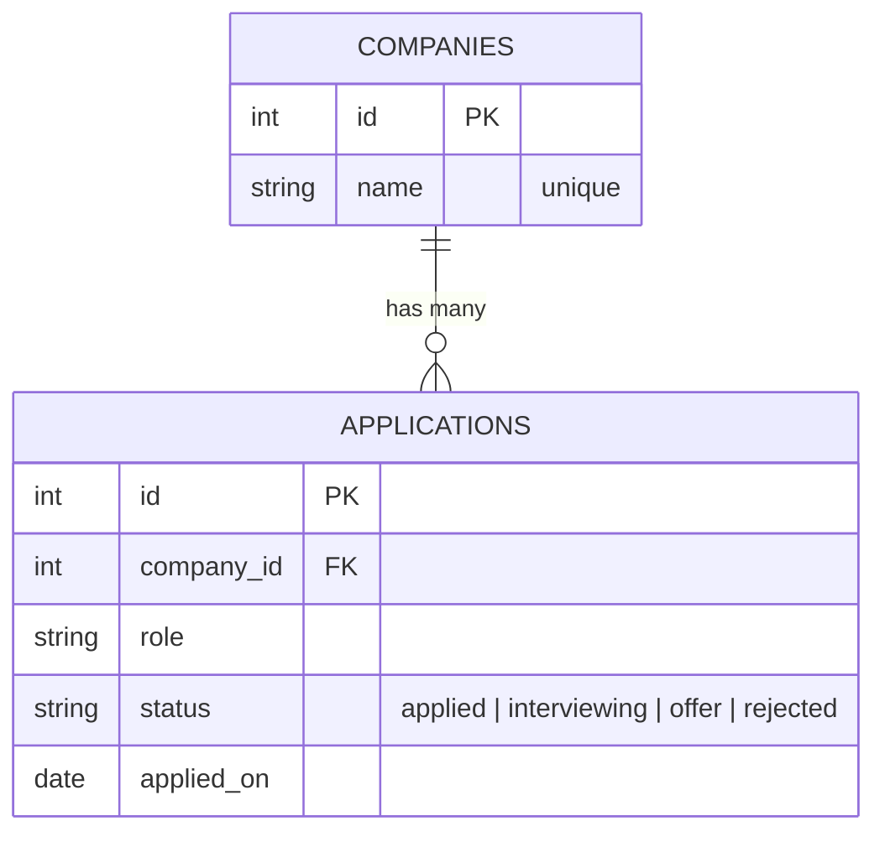
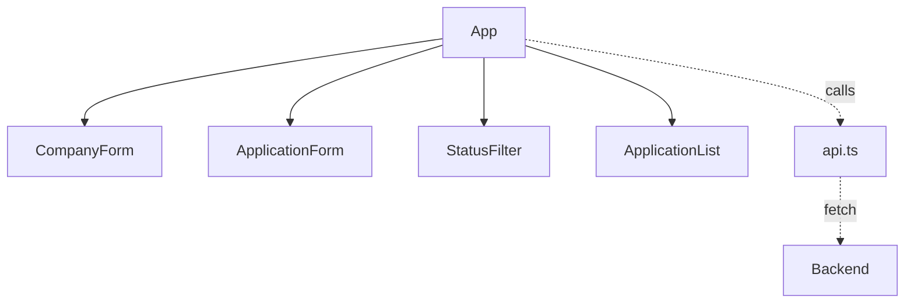

# 00 — Briefing

Read this once before starting. It's organized like a five-paragraph
briefing (**SMEAC**): Situation, Mission, Execution, Admin, and Command.

---

## Situation

You built a job application tracker in Tiro with a guide beside you for
every line. The core works, but it has known weak spots — the same ones
real projects accumulate:

- The database URLs are hard-coded in three places (`database.py`,
  `conftest.py`, and `alembic.ini`).
- Anyone can send `status: "ghosted"` or a company named `"   "`.
- Every route is in one file.
- The company is a free-text string, so "Acme" and "ACME" are different
  companies and there's no list of companies to pick from.
- `App.tsx` and `api.ts` have no tests.
- If an action fails, the user sees nothing.

## Mission

Rebuild the tracker **from an empty folder**, test-first, using the
provided tests as your specification, and fix every weak spot above.

**End state:** 37 backend tests and 38 frontend tests passing, full
pre-commit checks green, and the app working in the browser — on the
same stack as Tiro (async SQLAlchemy, asyncpg, PostgreSQL in Docker),
with Miles's database on host port **5434**.

### The user stories

US-1 to US-5 from Tiro (record, see all, update, delete, persist) still
apply. Miles adds:

| ID | Story | Delivered in |
| --- | --- | --- |
| **US-6** | Pick a company from a list instead of retyping it | Lessons 03, 05 |
| **US-7** | Filter applications by status | Lessons 02, 05, 06 |
| **US-8** | See a clear message when something fails | Lessons 04, 06 |
| **US-9** | Have nonsense input refused | Lessons 02, 03, 04 |

Every lesson opens with a **Where this fits** box naming its stories.
When a contract feels arbitrary, look at the story it serves.

## Execution

Two backend phases, then the frontend.

**Phase 1 (lesson 02)** — rebuild Tiro's API with improvements.
**Phase 2 (lesson 03)** — promote company to its own table.

### Where you're headed: the data model



Read `||--o{` as "one company has zero or more applications."

### The final API

| Method | Path | Body | Success | Errors |
| --- | --- | --- | --- | --- |
| `GET` | `/health` | — | `200` | — |
| `POST` | `/companies` | `{name}` | `201` | `409` duplicate, `422` blank |
| `GET` | `/companies` | — | `200`, sorted by name | — |
| `POST` | `/applications` | `{company_id, role, status?, applied_on}` | `201` | `422` bad input or unknown company |
| `GET` | `/applications?status=&company_id=` | — | `200`, by id | `422` unknown status |
| `GET` | `/applications/{id}` | — | `200` | `404` |
| `PATCH` | `/applications/{id}` | any subset of fields | `200` | `404`, `422` |
| `DELETE` | `/applications/{id}` | — | `204` | `404` |

### The final frontend



`App` owns all data and talks to `api.ts`. The four components only
receive props and call callbacks.

## Admin (how each lesson works)

Every lesson follows this rhythm:

1. **Contract** — the exact **files**, names, shapes, and labels the
   tests expect. If your code doesn't match the contract, the tests
   can't find it.
2. **Copy the test file in, and run it.** 🔴 Red.
3. **Connect the dots** — what the step needs and where it comes from.
   Answer the question before reading on.
4. **Pseudocode** for anything new, with a plain-English definition of
   each new term.
5. **You write the code.** 🟢 Green.
6. **Hints**, hidden, in increasing order of help. Open one, try again,
   then the next only if you need it.
7. **Commit.**

### Rules

- **Never edit a provided test to make it pass.** The tests are the
  specification. If one seems wrong, re-read the contract, then report
  it.
- **Make one test pass at a time.** Run a single test with
  `uv run pytest -k create_returns` or the ▶ button in VS Code's Testing
  sidebar.
- **Commit on every green.** Small commits make mistakes cheap to undo.
- **Look back at Tiro freely.** Your own Tiro code is a legitimate
  reference. Copy-pasting whole files from it defeats the purpose, but
  checking how you did something is exactly what a working developer
  does.

### Running a subset of tests

```bash
# Backend: tests whose names contain "create"
uv run pytest -k create

# Backend: one file
uv run pytest tests/test_companies.py

# Frontend: one file, watch mode
npm test -- ApplicationList
```

## Command (getting help without an AI)

In order:

1. The **failing test's name and message** — they usually say exactly
   what's wrong.
2. The lesson's **contract** and **hints**.
3. [`troubleshooting.md`](troubleshooting.md) here, then Tiro's.
4. The **official docs** linked in each lesson.
5. Your own **Tiro code**.

---

## Explain it back

**1. Why are the tests provided in Miles instead of written by you?**

<details>
<summary>Answer</summary>

Fading. In Tiro you studied full solutions; in Miles the solution steps
are removed but the specification (tests) remains, so you practice
producing the code yourself. In Veteranus the tests are removed too.
</details>

**2. What does the contract in each lesson protect you from?**

<details>
<summary>Answer</summary>

Correct code that the tests can't find — a button labeled "Add" when the
test looks for "Add company," or a function named `getApplications` when
the test imports `fetchApplications`.
</details>

Next: [01 — Scaffold from memory](01-scaffold.md)
